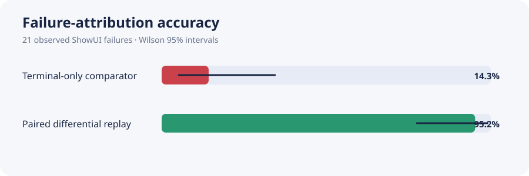

# UI-FaultLab

[](https://github.com/kakoyvostorg/ui-faultlab/actions/workflows/ci.yml)
[](LICENSE)

UI-FaultLab — компактный исполняемый прототип для исследования конкретной проблемы надёжности GUI-агентов:

> Если визуальный UI-тест завершился неудачей, может ли диагностика по траектории и повторному выполнению действий надёжнее отличить ошибку агента от дефекта приложения, чем оценка только по финальному скриншоту?

Репозиторий содержит детерминированное приложение Mini Calendar, наблюдения только через скриншоты, три типа ошибок агента, три типа ошибок приложения, возобновляемое сохранение артефактов, оценку по фактическому выполнению, контролируемое исследование на 36 эпизодах, action-baseline ShowUI-2B на 12 эпизодах и зафиксированный paired-эксперимент с обученным агентом на 24 случаях.

Это небольшое контролируемое синтетическое исследование, вдохновлённое задачами надёжности GUI-агентов. Это не production-система тестирования, не универсальный benchmark и не заявление о state of the art.

## Основной результат

### Paired-атрибуция с обученным агентом

В главном end-to-end эксперименте используются реальные траектории ShowUI-2B, а не scripted actor. ShowUI был запущен по одному разу на каждом из 24 заранее зафиксированных candidate-кейсов и сделал 122 вызова модели. Затем каждое успешно распарсенное действие candidate без изменений воспроизводилось на заведомо исправной reference-версии — без дополнительных вызовов VLM.

Candidate не выполнил 21 из 24 задач. Дифференциальный replay, не знающий скрытого условия, правильно атрибутировал **20/21 = 95,2%** падений (95%-й интервал Уилсона: 77,3–99,2%). Он нашёл все 3 причинно различимые регрессии приложения, не выдал **ни одного ложного обвинения приложения в 18 остальных падениях** и вернул `ambiguous` для 7 из 21 падений. Существующий terminal-only comparator, который считает каждое падение регрессией приложения, правильно классифицировал только 3/21 случаев и ошибочно обвинил приложение во всех 18 случаях, не относящихся к доказанной регрессии.



Это небольшой синтетический результат, а не универсальная оценка качества GUI-агентов: в выборке всего три причинно различимые регрессии, а все кейсы относятся к одному календарному интерфейсу. В восьми faulted-кейсах gold-консервативно равен `ambiguous`, потому что та же последовательность действий провалилась и на reference. Подробности: [отчёт по paired-эксперименту](report/PAIRED_RESULTS.md), [галерея траекторий](report/paired_results/trace_gallery.html), [метрики](artifacts/paired_metrics.json) и [проверенный архив сырых данных](artifacts/paired_same_task_run.tar.gz).

### Контролируемая проверка механизма

Зафиксированный эксперимент содержит 36 эпизодов: 4 задачи × 3 seed × clean/agent-fault/application-fault. Все значения в отчёте заново рассчитываются из `artifacts/episodes/*/evaluation.json`.

| Метод диагностики | Precision для багов приложения | Recall для багов приложения | Accuracy | Доля ложных bug report |
|---|---:|---:|---:|---:|
| Только финальный экран | 12/24 = 50,0% | 12/12 = 100,0% | 12/24 = 50,0% | 12/12 = 100,0% |
| Пассивный анализ траектории | 12/16 = 75,0% | 12/12 = 100,0% | 20/24 = 83,3% | 4/12 = 33,3% |
| Один активный replay | 12/12 = 100,0% | 12/12 = 100,0% | 24/24 = 100,0% | 0/12 = 0,0% |

Для основной метрики active app-bug precision 95%-й интервал Уилсона составляет 75,8–100,0%. Результат точен для этих fixtures, но выборка мала, эпизоды коррелированы общими шаблонами, а среда синтетическая. В [`report/REPORT.md`](report/REPORT.md) приведены знаменатели, интервалы, paired bootstrap, тест Мак-Немара, стоимость и ограничения.

### Предшествующий action-baseline ShowUI-2B

Обученный агент был запущен на 12 чистых эпизодах заведомо исправного приложения: 4 задачи × 3 детерминированных seed. Он сделал 53 реальных вызова модели и выполнил 3/12 задач (25,0%; 95%-й интервал Уилсона: 8,9–53,2%). Все три успеха относятся к короткому сценарию `delete_event`; три семейства задач с формами провалились на каждом seed.


Ошибки наблюдались в реальных траекториях, а не были придуманы заранее. В `create_event` агент трижды нарушил строгий протокол, сгенерировав несколько действий одновременно. В сценариях добавления участника и переноса встречи он выбирал неправильные поля формы, после чего зацикливался или исчерпывал бюджет шагов. См. [полный отчёт ShowUI](report/SHOWUI_RESULTS.md), [интерактивную галерею траекторий](report/showui_results/trace_gallery.html), [машиночитаемую сводку](artifacts/showui_full_summary.json) и [полный архив траекторий](artifacts/showui_full_run.tar.gz).

## Быстрый запуск

Основной runtime использует только стандартную библиотеку Python. Требуется Python 3.11 или новее.

```bash
python3 -m venv .venv
.venv/bin/python -m pip install pytest
.venv/bin/pytest -q
```

Запуск одного детерминированного эпизода:

```bash
python3 scripts/run_episode.py \
  --config configs/local_smoke.yaml \
  --agent scripted \
  --task create_event
```

Запуск веб-интерфейса Mini Calendar:

```bash
python3 -m app.server --host 127.0.0.1 --port 8765
```

После этого откройте `http://127.0.0.1:8765`. Браузерный интерфейс показывает только обычное состояние приложения. Тип внедрённой ошибки и состояние evaluator в нём никогда не отображаются.

## Воспроизведение зафиксированного эксперимента

Запускайте split по порядку. На этапе validation создаётся `artifacts/freeze.json`; test отказывается запускаться без двух явных флагов и совпадающего хеша зафиксированной конфигурации.

```bash
python3 scripts/run_experiment.py --config configs/experiment.yaml --split dev
python3 scripts/run_experiment.py --config configs/experiment.yaml --split validation
python3 scripts/run_experiment.py \
  --config configs/experiment.yaml \
  --split test \
  --evaluate-test \
  --allow-test \
  --test-reason "final evaluation after frozen deterministic-v1 validation"
python3 scripts/build_report.py --artifacts artifacts --output report/REPORT.md
```

Завершённые эпизоды с тем же хешем конфигурации возобновляются, а не перезаписываются. Используйте `--force` только для намеренного повторного запуска; перед этим стоит отдельно сохранить старые результаты.

## Среда и задачи

Mini Calendar предоставляет четыре многошаговые задачи:

- `create_event`: ввести название, дату и время, затем сохранить встречу;
- `add_attendee`: открыть встречу Design Review, добавить участника и сохранить;
- `reschedule_event`: открыть Design Review, заменить время и сохранить;
- `delete_event`: открыть Deprecated Sync, удалить встречу и подтвердить действие в модальном окне.

Действия используют валидируемую нормализованную схему: `tap(x,y)`, `input(x,y,text)`, `type(text)`, `scroll(direction)`, `back` и `finish`. Операция `input` атомарно фокусирует видимое поле и вводит текст, что соответствует официальной семантике действий ShowUI. Координаты `[x,y]` нормализованы в диапазон `[0,1]` и отсчитываются от левого верхнего угла скриншота. Reset-состояние, порядок событий, текст задачи и отрисовка скриншотов детерминированы для заданного seed.

## Ошибки и причинные метки

Agent faults перехватывают одно запрошенное действие. В привилегированных логах сохраняются и intended action, и фактически выполненное действие:

- `coordinate_jitter`;
- `wrong_candidate`;
- `duplicate_action`.

Application faults изменяют реальный переход или сохраняемое состояние приложения:

- `save_noop`;
- `value_corruption`;
- `confirmation_transition_bug`.

Каждый обязательный faulted-эпизод содержит ровно одно семейство ошибок. Gold-метаданные записываются в `gold.json` только после фиксации идентичности эпизода; они исключены из сериализаторов агента и основной диагностики.

## Граница screenshot-only

| Компонент | Разрешено | Запрещено |
|---|---|---|
| Визуальный агент | Инструкция, путь к скриншоту, история запрошенных действий | DOM, accessibility tree, backend state, тип fault, target boxes, success predicates |
| Terminal diagnoser | Инструкция, финальный скриншот, факт падения | История действий, backend state, gold label |
| Passive diagnoser | Инструкция, скриншоты, запрошенные действия, видимый результат перехода | Подмена выполненного действия, injector metadata, backend state, gold label |
| Active diagnoser | Пассивный контекст и один replay-скриншот | Содержимое восстановленного состояния, настройка app fault, backend state, gold label |
| Oracle/evaluator | Всё привилегированное состояние | Не применимо; всегда явно обозначается как oracle |

Артефакт `steps.jsonl` намеренно сохраняет intended/executed actions для последующего аудита. Перед основной диагностикой `public_trajectory()` удаляет выполненные действия и признаки инъектора. Тесты падают, если через эту границу проходят запрещённые поля.

## Режимы диагностики

1. **Terminal-only** видит только неуспешный финальный скриншот и намеренно служит слабым baseline.
2. **Passive trajectory** анализирует видимые переходы между скриншотами и действиями и выбирает первый подозрительный шаг.
3. **Active replay** восстанавливает среду непосредственно перед подозрительным шагом и один раз выполняет intended action при том же состоянии приложения. Классификация строится по совпадению видимых переходов, а не по скрытому fault label.
4. **Oracle** читает привилегированные fault-метаданные только как верхнюю границу evaluator.

Три основных diagnoser в контролируемом attribution-эксперименте детерминированы и не используют модели. Это позволяет отдельно проверить среду и механизм causal replay. Последующий запуск ShowUI проверяет генерацию действий обученным визуальным агентом, а не качество обученной модели диагностики.

## Open VLM baseline

Checkpoint ShowUI-2B был проверен по официальным источникам и зафиксирован на revision `cabec4fcc48d15ffd3efe0b33ea9bc7d41509d60`. Adapter следует официальному протоколу словаря с одним действием, использует нормализованные координаты `[x,y]` и официальные границы preprocessing. Исходные генерации сохраняются без изменений и разбираются строгим literal parser; некорректные ответы и генерации с несколькими действиями считаются ошибками, а не исправляются автоматически.

После проверки зависимостей и драйверов финальная облачная среда использовала PyTorch 2.6.0, CUDA 11.8 и быстрый image processor Qwen2-VL. Сначала smoke test с двумя inference подтвердил, что модель нажимает нужные видимые элементы. Затем успешно завершился зафиксированный прогон на 12 эпизодах:

- модель загружена: да;
- реальные вызовы модели: 53;
- выполненные задачи: 3/12, все `delete_event`;
- атрибуция девяти падений: `agent_error`, поскольку приложение было чистым и заведомо исправным;
- сохранённые данные: каждый скриншот, raw output, распарсенное действие, latency, transition hash и причина остановки.

Этот обученный baseline намеренно отделён от контролируемого causal attribution benchmark на 36 эпизодах. Он даёт реальные траектории агента, не ослабляя контролируемые метки основного механистического эксперимента. См. [`VLM_BASELINE.md`](VLM_BASELINE.md) и [`report/SHOWUI_RESULTS.md`](report/SHOWUI_RESULTS.md).

## Артефакты

Каждый эпизод содержит:

```text
artifacts/episodes/<opaque_episode_id>/
  manifest.json
  gold.json
  steps.jsonl
  step_000.png ...
  probe/*.png
  diagnosis_terminal.json
  diagnosis_trajectory.json
  diagnosis_active.json
  diagnosis_oracle.json
  evaluation.json
```

Общие результаты:

- `artifacts/registry.json`: атомарный реестр для возобновления запусков;
- `artifacts/freeze.json`: фиксация конфигурации перед test;
- `artifacts/test_access_log.jsonl`: журнал явного доступа к test;
- `artifacts/predictions/<method>/*.json`: машиночитаемые предсказания;
- `artifacts/tables/metrics.json`: источник всех метрик отчёта;
- `artifacts/tables/attribution_summary.csv`: компактный экспорт метрик;
- `artifacts/tables/demo_traces.json`: ранжированные траектории для демонстрации;
- `artifacts/showui_full_summary.json`: агрегированные и поэпизодные результаты обученного baseline;
- `artifacts/showui_full_run.tar.gz`: все 12 траекторий ShowUI, включая 62 скриншота и 53 записи шагов;
- `artifacts/paired_preregistration.json`: зафиксированные баланс кейсов, revision модели, лимит вызовов и хеши конфигурации paired-прогона;
- `artifacts/paired_same_task_summary.json`: результаты candidate/reference и предсказания по всем случаям;
- `artifacts/paired_metrics.json` и `artifacts/paired_metrics.csv`: confusion matrices, интервалы, paired-сравнение, runtime и оценка стоимости;
- `artifacts/paired_same_task_run.tar.gz`: проверенные сырые candidate/reference-траектории и изолированный causal gold;
- `artifacts/cost_ledger.csv`: журнал облачных запусков с оценками стоимости по времени работы; фактический billing пока не указан;
- `report/failure_gallery/index.html`: шесть визуальных контрфактуальных примеров;
- `report/showui_results/trace_gallery.html`: четыре показательные траектории обученного агента с raw outputs;
- `report/paired_results/trace_gallery.html`: сравнения candidate/reference для app regression, agent failure, ambiguous case и единственной ошибки атрибуции.

## Структура репозитория

```text
app/                    состояние, задачи, faults, сервер и браузерный UI Mini Calendar
ui_faultlab/actions.py  строгая схема нормализованных действий
ui_faultlab/environment.py детерминированное выполнение, snapshots и screenshot boundary
ui_faultlab/faults/     перехватчики ошибок агента
ui_faultlab/agents/     scripted oracle и защищённый adapter ShowUI
ui_faultlab/diagnosis/  terminal, trajectory, active replay и oracle
ui_faultlab/evaluation/ метрики, интервалы Уилсона и paired-статистика
ui_faultlab/artifacts/  manifest и атомарный resume registry
scripts/                запуск эпизодов, экспериментов, model gate, галерей и отчётов
tests/                  unit- и integration-проверки критериев приёмки
report/showui_results/  графики, галерея, сводка и архив обученного baseline
report/paired_results/  графики differential replay и candidate/reference gallery
```

## Бюджет и безопасность облачных запусков

Оператор разрешил потратить не более 600 ₽ из баланса 684 ₽, сохранив резерв 84 ₽. Первый ShowUI-прогон на 12 случаях работал 719,132 секунды; оценка его стоимости по времени составляет 33,66–46,74 ₽. Paired-прогон на 24 случаях работал 1024,101 секунды и оценивается в 47,93–66,57 ₽. Консервативная сумма всех строк ledger — включая setup, неуспешные preflight, smoke, full run и paired run — составляет 295,21 ₽, то есть остаётся значительно ниже разрешённого потолка. Это оценки, а не подтверждённые списания: `actual_cost_rub` останется равным нулю до получения billing от провайдера.

У каждого платного job был заранее объявленный лимит времени. Полный runner сохранял сводку и сжатые траектории после каждого эпизода. Для воспроизведения отчёта из загруженных артефактов новые облачные запуски не требуются. Credentials и cloud project ID не сохраняются в репозитории.

## Демонстрация

Для основной демонстрации attribution откройте `report/paired_results/trace_gallery.html`; для контролируемой проверки механизма — `report/failure_gallery/index.html`; для раннего action-baseline ShowUI — `report/showui_results/trace_gallery.html`. В [`DEMO.md`](DEMO.md) находятся рассказ на 60–90 секунд и список проверок перед собеседованием.
