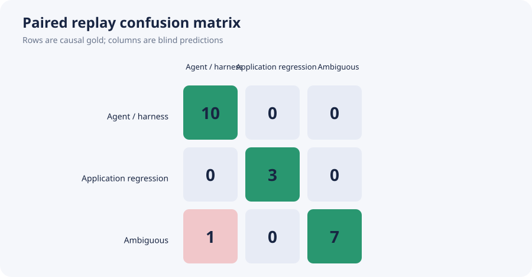
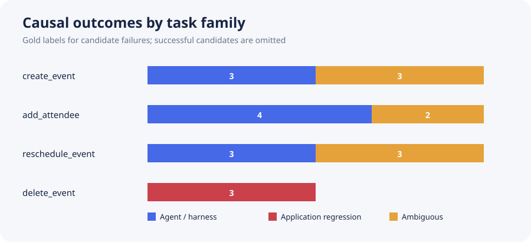

# Paired same-task ShowUI differential replay

## Result

ShowUI-2B ran on 24 frozen candidate tasks and made **122 actual model calls**. Every successfully parsed candidate action was replayed verbatim on a known-good reference without any extra VLM calls. The candidate failed on 21/24 tasks. Blind differential replay correctly attributed **20/21 failures = 95.2%** (Wilson 95% CI 77.3%–99.2%).

| method | accuracy | app-regression precision | app-regression recall | false bug reports among non-app failures | ambiguous predictions |
|---|---:|---:|---:|---:|---:|
| terminal-only comparator | 3/21 (14.3%) | 3/21 (14.3%) | 3/3 (100.0%) | 18/18 (100.0%) | 0/21 |
| paired differential replay | 20/21 (95.2%) | 3/3 (100.0%; CI 43.9%–100.0%) | 3/3 (100.0%) | 0/18 (0.0%) | 7/21 (33.3%) |

The terminal comparator intentionally labels every failure as an application regression and is included as an existing weak comparator, not as a newly preregistered baseline. Paired replay improves accuracy by **81.0 percentage points**; paired bootstrap 95% CI is 61.9–95.2 pp. McNemar exact two-sided p=0.000015, descriptive only because cases share templates.

## What the labels mean

- `application_regression`: candidate failed, but the same ShowUI actions succeeded on the reference; 3 cases, all faulted delete flows.
- `agent_or_harness`: candidate and reference failed identically without a decisive application effect; 10 gold cases.
- `ambiguous`: an application fault was reached, but the exact action sequence also failed on the reference, so neither source uniquely explains task failure; 8 gold cases.
- `no_failure`: the candidate succeeded; 3 clean delete cases, excluded from attribution metrics.

| task | correct / failures | accuracy | predicted ambiguous |
|---|---:|---:|---:|
| `add_attendee` | 5/6 | 83.3% | 1/6 |
| `create_event` | 6/6 | 100.0% | 3/6 |
| `delete_event` | 3/3 | 100.0% | 0/3 |
| `reschedule_event` | 6/6 | 100.0% | 3/6 |

The sole error was `attendee_01`: a value-corruption fault was reached, but both candidate and reference failed; identical terminal pixels caused the blind rule to say `agent_or_harness`, while causal gold conservatively marked the case `ambiguous`.

## Protocol and leakage boundary

- 4 task families × 3 splits × 2 hidden conditions = 24 cases; every task/split cell has one clean and one faulted candidate.
- Model and revision were frozen before execution; config hash: `a59fd48faa3a8b02cb3c3b68a3cf71d91defce8ff8f62a9cca7acc14f637255d`.
- ShowUI saw task text, screenshot, and its recent raw actions only. Candidate fault, target state, predicates, reference outcome, and gold were hidden.
- Reference replay used exact parsed candidate actions. It did not repair actions, ask ShowUI again, or use a label oracle.
- Diagnosis was written before the quarantined causal gold file. Gold additionally checked whether the hidden fault was actually reached.
- Raw screenshots, model outputs, parsed actions, stop reasons, hashes, and latencies are retained. See the [trace gallery](paired_results/trace_gallery.html).

## Runtime and cost

- Cloud job wall time: 1024.1s (17.1 min).
- Runtime-derived estimate: 47.93–66.57 RUB depending on allocated declared GPU; provider billing was not queried, so this is not an actual charge.
- Hard cap: 60 minutes and 160 calls; actual: 122 calls.

## Honest limitations

The result answers a narrow experimental question on one deterministic synthetic calendar. The 95.2% is not a general GUI-agent score: only 21 failures were attributed, only 3 had decisive application-regression gold, and cases share UI/task templates. The paired rule is expected to be strong when exact replay is deterministic. Its value is the auditable abstention behavior: when both copies fail, it avoids inventing certainty. Broader claims require additional applications, agents, naturally occurring regressions, and repeated stochastic runs.
