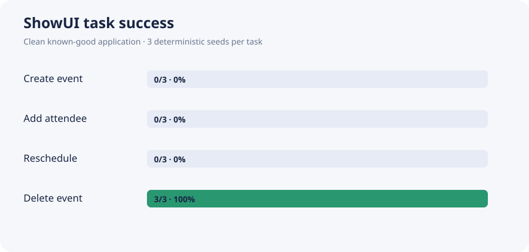
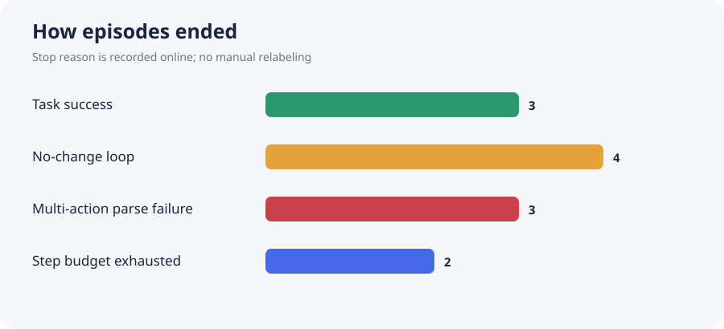
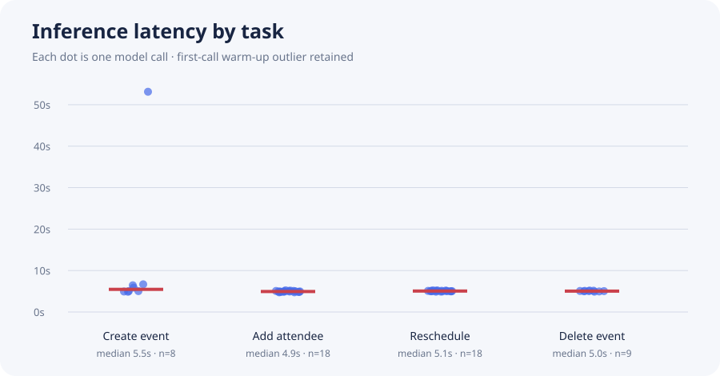

# ShowUI-2B closed-loop baseline

This is the learned-agent companion to UI-FaultLab's 36-episode controlled attribution benchmark. ShowUI saw only the task text, current screenshot, and the last four raw actions. The application was known-good and had no injected faults, so every failed task is attributable to the agent; successful tasks have no failure label.

## Headline result

**3/12 tasks succeeded (25.0%; Wilson 95% CI 8.9%–53.2%).** All three successes were `delete_event`; the other three task families failed on every seed.

| task | successes | rate | Wilson 95% CI | VLM calls | mean steps |
|---|---:|---:|---:|---:|---:|
| `create_event` | 0/3 | 0.0% | 0.0%–56.1% | 8 | 2.7 |
| `add_attendee` | 0/3 | 0.0% | 0.0%–56.1% | 18 | 6.0 |
| `reschedule_event` | 0/3 | 0.0% | 0.0%–56.1% | 18 | 6.0 |
| `delete_event` | 3/3 | 100.0% | 43.9%–100.0% | 9 | 3.0 |

## What failed

- `create_event`: 3/3 failures. The model found the correct button, then emitted multiple actions in one turn; the strict one-action executor rejected all three traces rather than silently repairing them.
- `add_attendee`: 3/3 failures. It opened the correct event, but placed the email in the title field instead of the attendee field.
- `reschedule_event`: 3/3 failures. It placed the new time in the date field, saved, and then wandered or looped.
- `delete_event`: 3/3 successes, always in three valid clicks: card → Delete → Confirm.

The visual [trace gallery](showui_results/trace_gallery.html) contains one full trajectory per task with screenshots and raw outputs.

## Runtime and action statistics

- Episodes: 12; VLM calls: 53.
- Mean call latency: 6.00s; median: 5.04s; p95: 6.45s.
- Actions: input=6, parse_error=3, scroll=14, tap=30.
- Parse failures: 3/53 (5.7%).
- No-change transitions: 13/53 (24.5%).
- Cloud job wall time: 719.1s. Runtime-derived cost range: about 33.66–46.74 RUB depending on which declared GPU instance was allocated; billing was not yet available when this report was generated.

## Reproducibility boundary

- Model: `showlab/ShowUI-2B`, pinned revision `cabec4fcc48d15ffd3efe0b33ea9bc7d41509d60`.
- Protocol: `official-showui-navigation-v1`; task observation version `1.1`.
- Config hash: `dd6597076cd7b756c413b154cd7fc6d6203a223ca9a2a74d9eec3e330c21a6b2`.
- Deterministic seeds/splits: dev=0, validation=1, test=2.
- Raw outputs are preserved exactly. Invalid multi-action outputs are counted as failures, not repaired.
- The fast Qwen2-VL image processor was used because the checkpoint's current configuration is incompatible with the legacy slow processor. This can affect exact output parity with older releases.

## Interpretation

This run supports a narrow claim: ShowUI-2B can ground salient controls and complete the short delete flow, but it is unreliable on form-heavy multi-step tasks in this synthetic calendar. The 25% rate is not a general GUI-agent benchmark score—the sample is only 12 template-correlated episodes. Its purpose is to replace hypothetical agent errors with reproducible observed trajectories while keeping the causal attribution benchmark separate and controlled.
